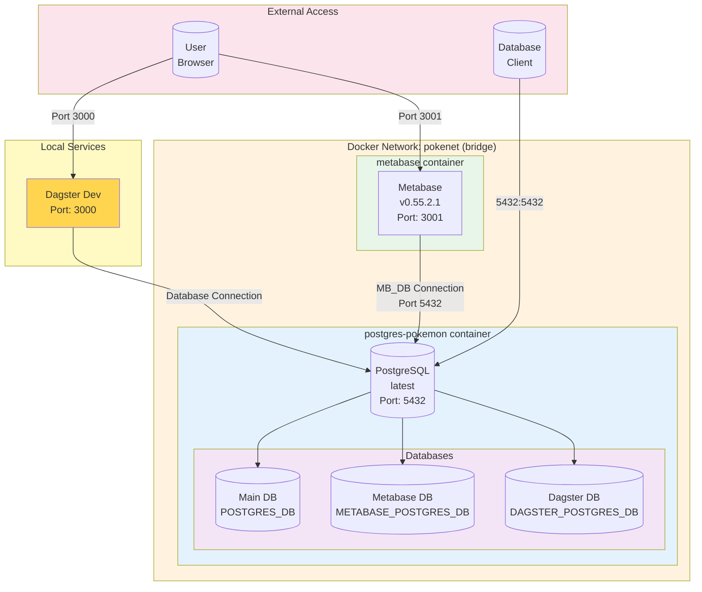

# Infrastructure Architecture

This diagram shows the infrastructure setup for the Pokemon TCG Pocket Metagame project based on the `compose.yaml` configuration.

## Components

### Dagster Dev
- **Port**: `3000`
- **Purpose**: Data orchestration platform for managing data pipelines and workflows
- **Deployment**: Runs locally via `dagster dev` command
- **Database**: Stores run history and metadata in PostgreSQL (`DAGSTER_POSTGRES_DB`)
- **Access**: Dagster UI available at `http://localhost:3000`

### Metabase
- **Image**: `metabase/metabase:v0.55.2.1`
- **Container**: `metabase`
- **Port**: `3001`
- **Purpose**: Analytics and business intelligence platform
- **Database**: Stores metadata in PostgreSQL (`METABASE_POSTGRES_DB`)
- **Access**: Metabase UI available at `http://localhost:3001`

### PostgreSQL
- **Image**: `postgres:latest`
- **Container**: `postgres-pokemon`
- **Port**: `5432:5432`
- **Purpose**: Primary database server hosting multiple databases
- **Initialization**: Scripts in `./initdb` directory run on first startup
- **Databases**:
  - Main application database (`POSTGRES_DB`)
  - Metabase metadata database (`METABASE_POSTGRES_DB`)
  - Dagster storage database (`DAGSTER_POSTGRES_DB`)

### Network
- **Name**: `pokenet`
- **Driver**: `bridge`
- **Purpose**: Internal communication between containers

## Notes
- All environment variables are configured via `.env` file
- PostgreSQL initialization scripts can be added to `./initdb` directory
- Dagster runs locally via `dagster dev` and connects to the PostgreSQL container
- Both Dagster (port 3000) and Metabase (port 3001) provide web interfaces for users
